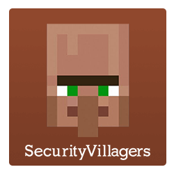

  
  
  
  

# SecurityVillagers
<b>SecurityVillagers</b> is a plugin for Minecraft servers that allows the protection of villagers. You can choose which players/groups can attack/interact with villagers.

[Read more about SecurityVillagers here!](https://alessiodp.com/securityvillagers.php)

 

## Downloads
### [Spigot page](https://www.spigotmc.org/resources/securityvillagers.6064/)
### [Bukkit page](https://dev.bukkit.org/projects/securityvillagers)

 

## Wiki
**[You can find the wiki here!](https://alessiodp.com/wiki/securityvillagers/)**
